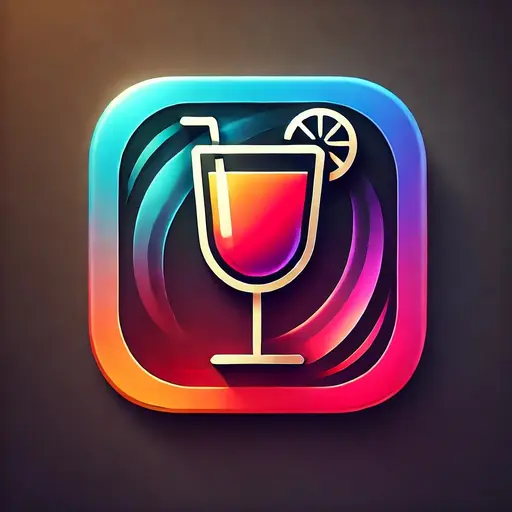
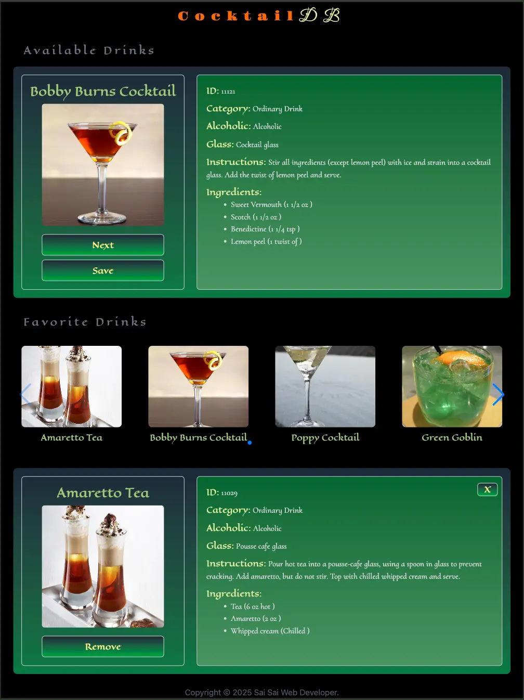
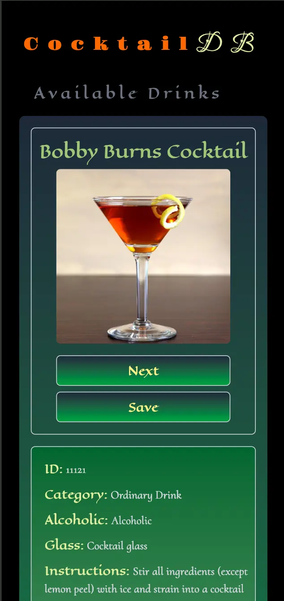
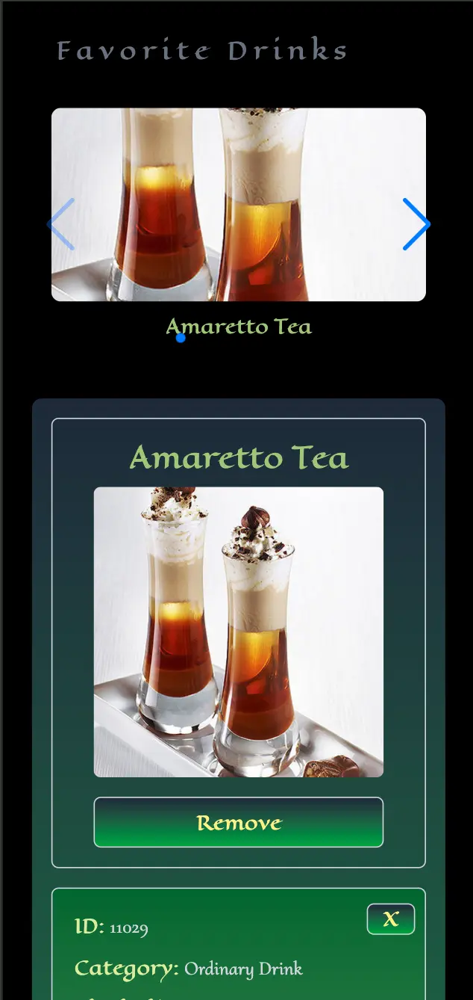

# The Cocktail DB 🍸

A sleek React app that allows users to explore various cocktails using the CocktailDB API. Users can search, view details, and discover random drinks in an elegant interface.

# 📷 Screenshots








# ✨ Features

View detailed information for each cocktail

Explore ingredients, glass type, and category

Random cocktail generator

Responsive design with smooth user experience


# 🛠 Tech Stack

React

React Router DOM

Axios

Tailwind CSS

Vite


# 📁 Project Structure

.
├── src/
│   ├── components/
│   │   └── ui/
│   │       ├── CustomDialog.jsx
│   │       ├── dialog.jsx
│   │       └── RemoveItem.jsx
│   │   
│   ├── App.jsx
│   ├── FavoriteCarousel.jsx
│   ├── Favorites.jsx
│   ├── Footer.jsx
│   ├── index.css
│   ├── indexedDB.js
│   ├── IngredientsList.jsx
│   └── main.jsx
├── package.json
└── vite.config.js


# 📦 Installation

Clone the repository:
```bash
git clone https://github.com/zeethonSE/the-cocktail-db.git
cd the-cocktail-db
```
Install dependencies:
```bash
npm install
```
Create a .env file (optional, if you're using API key or custom configs)
```bash
VITE_API_BASE_URL=https://www.thecocktaildb.com/api/json/v1/1
```

Run the app:
```bash
npm run dev
```
Visit http://localhost:5173


# 🚀 Live Demo

Frontend deployed on Vercel (example):

https://the-cocktail-db.vercel.app

Be sure to update this with your actual deployed URL if available!


# 💾 Offline Storage

Favorite drinks (IDs, names, images) are stored in IndexedDB

Drink images are also cached locally, so they appear offline

No backend or server-side database is used


# ✅ To Do / Improvements

Add favorite/save cocktail feature

Add pagination or infinite scroll

Improve error handling and loading states

Add unit tests or integration tests


# ✨ Credits

TheCocktailDB for their open API

Icons & animations from Heroicons and Framer Motion

# 🙋‍♂️ Author

Sai Sai

💼 Web Developer

📧 zeethon0@gmail.com

🔗 [LinkedIn](https://linkedin.com/in/ssaiwd25)

# 📄 License

This project is open source and available under the [MIT License.](MIT-LICENSE)